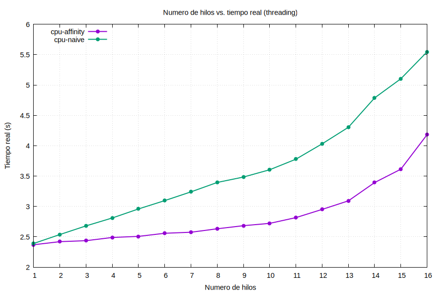
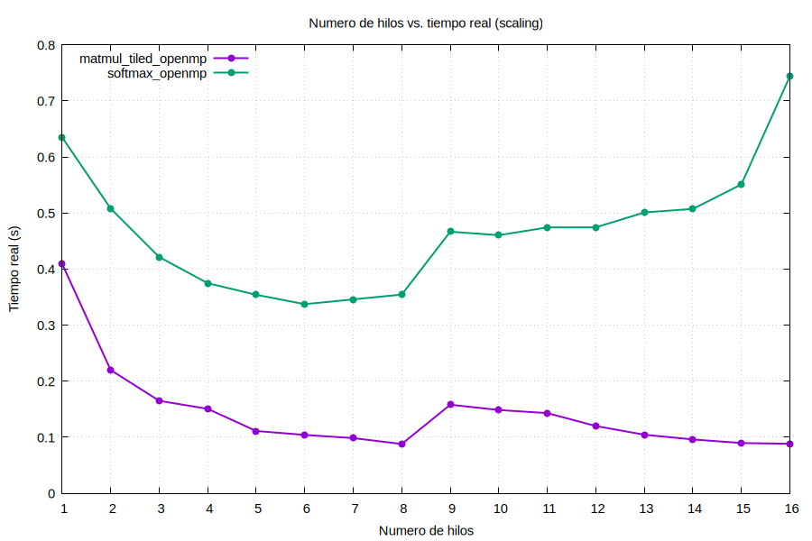

## Ejercicio A

```bash
# Ir al directorio

cd threading

make

# cpu-affinity

time ./cpu-affinity

# cpu-naive

time ./cpu-naive
```
### Código

La laptop cuenta con un total de **16 hilos**. Sin embargo, el programa está configurado inicialmente para utilizar 8 hilos. Para realizar las pruebas con diferentes cantidades de hilos, es necesario modificar las siguientes líneas del código:

```c
#define NUM_THREADS 8
```

En esta línea se cambia el valor de `8` por la cantidad de hilos que se desea utilizar, por ejemplo `1`, `2`, `3`, ..., `16`.

Además, se debe actualizar el arreglo que indica los hilos disponibles:

```c
int cpu_map[NUM_THREADS] = {0, 1, 2, 3, 4, 5, 6, 7};
```

Para utilizar más hilos, se agregan los identificadores correspondientes. Por ejemplo, para 16 hilos:

```c
int cpu_map[NUM_THREADS] = {
    0, 1, 2, 3, 4, 5, 6, 7,
    8, 9, 10, 11, 12, 13, 14, 15
};
```

De esta forma, se pueden realizar las pruebas utilizando desde 1 hasta 16 hilos.

### Resultados

**Hilos totales disponibles:** 16


### Ejercicio A — cpu-affinity

| Hilos (N) | real (s) | user (s) | sys (s) | Speedup S(N) | Eficiencia E(N) |
|-----------|----------|----------|---------|--------------|------------------|
| 1         | 2.369    | 2.257    | 0.111   | 1.00         | 100.0%           |
| 2         | 2.420    | 4.548    | 0.253   | 0.98         | 48.9%            |
| 3         | 2.436    | 6.855    | 0.369   | 0.97         | 32.4%            |
| 4         | 2.489    | 9.175    | 0.571   | 0.95         | 23.8%            |
| 5         | 2.507    | 11.458   | 0.761   | 0.95         | 18.9%            |
| 6         | 2.558    | 13.868   | 0.931   | 0.93         | 15.4%            |
| 7         | 2.575    | 16.191   | 1.159   | 0.92         | 13.1%            |
| 8         | 2.632    | 18.653   | 1.404   | 0.90         | 11.3%            |
| 9         | 2.683    | 21.011   | 1.974   | 0.88         | 9.8%             |
| 10        | 2.721    | 23.369   | 2.207   | 0.87         | 8.7%             |
| 11        | 2.816    | 26.390   | 2.578   | 0.84         | 7.6%             |
| 12        | 2.951    | 29.411   | 3.279   | 0.80         | 6.7%             |
| 13        | 3.092    | 33.562   | 3.536   | 0.77         | 5.9%             |
| 14        | 3.393    | 38.197   | 4.066   | 0.70         | 5.0%             |
| 15        | 3.613    | 41.741   | 4.830   | 0.66         | 4.4%             |
| 16        | 4.181    | 44.569   | 5.421   | 0.57         | 3.5%             |


### Ejercicio A — cpu-naive

| Hilos (N) | real (s) | user (s) | sys (s) | Speedup S(N) | Eficiencia E(N) |
|-----------|----------|----------|---------|--------------|------------------|
| 1         | 2.390    | 2.257    | 0.132   | 1.00         | 100.0%           |
| 2         | 2.537    | 4.517    | 0.255   | 0.94         | 47.1%            |
| 3         | 2.680    | 6.833    | 0.350   | 0.89         | 29.7%            |
| 4         | 2.810    | 9.124    | 0.462   | 0.85         | 21.3%            |
| 5         | 2.959    | 11.451   | 0.565   | 0.81         | 16.2%            |
| 6         | 3.096    | 13.821   | 0.700   | 0.77         | 12.9%            |
| 7         | 3.240    | 16.366   | 0.754   | 0.74         | 10.5%            |
| 8         | 3.395    | 18.836   | 0.894   | 0.70         | 8.8%             |
| 9         | 3.484    | 21.207   | 0.963   | 0.69         | 7.6%             |
| 10        | 3.604    | 23.520   | 1.059   | 0.66         | 6.6%             |
| 11        | 3.778    | 26.209   | 1.176   | 0.63         | 5.8%             |
| 12        | 4.031    | 29.481   | 1.306   | 0.59         | 4.9%             |
| 13        | 4.303    | 32.936   | 1.434   | 0.56         | 4.3%             |
| 14        | 4.787    | 37.353   | 1.551   | 0.50         | 3.6%             |
| 15        | 5.102    | 42.057   | 1.708   | 0.47         | 3.1%             |
| 16        | 5.545    | 45.060   | 1.811   | 0.43         | 2.7%             |


### Ejercicio B — matmul_tiled_openmp

| Hilos (N) | Tiempo (s) | Speedup S(N) | Eficiencia E(N) |
|-----------|------------|--------------|------------------|
| 1         | 0.409287   | 1.00         | 100.0%           |
| 2         | 0.219762   | 1.86         | 93.1%            |
| 3         | 0.164967   | 2.48         | 82.7%            |
| 4         | 0.150601   | 2.72         | 68.0%            |
| 5         | 0.111049   | 3.69         | 73.7%            |
| 6         | 0.104072   | 3.93         | 65.6%            |
| 7         | 0.098422   | 4.16         | 59.4%            |
| 8         | 0.087868   | 4.66         | 58.2%            |
| 9         | 0.157941   | 2.59         | 28.8%            |
| 10        | 0.148539   | 2.76         | 27.6%            |
| 11        | 0.143002   | 2.86         | 26.0%            |
| 12        | 0.119916   | 3.41         | 28.4%            |
| 13        | 0.104439   | 3.92         | 30.2%            |
| 14        | 0.096024   | 4.26         | 30.5%            |
| 15        | 0.089644   | 4.57         | 30.4%            |
| 16        | 0.088299   | 4.64         | 29.0%            |


### Ejercicio B — softmax_openmp

| Hilos (N) | Tiempo (s) | Speedup S(N) | Eficiencia E(N) |
|-----------|------------|--------------|------------------|
| 1         | 0.634776   | 1.00         | 100.0%           |
| 2         | 0.507906   | 1.25         | 62.5%            |
| 3         | 0.421393   | 1.51         | 50.2%            |
| 4         | 0.374705   | 1.69         | 42.3%            |
| 5         | 0.353992   | 1.79         | 35.9%            |
| 6         | 0.337325   | 1.88         | 31.4%            |
| 7         | 0.345906   | 1.84         | 26.2%            |
| 8         | 0.354493   | 1.79         | 22.4%            |
| 9         | 0.466558   | 1.36         | 15.1%            |
| 10        | 0.460365   | 1.38         | 13.8%            |
| 11        | 0.474194   | 1.34         | 12.2%            |
| 12        | 0.474422   | 1.34         | 11.2%            |
| 13        | 0.500955   | 1.27         | 9.8%             |
| 14        | 0.507219   | 1.25         | 8.9%             |
| 15        | 0.550891   | 1.15         | 7.7%             |
| 16        | 0.743816   | 0.85         | 5.3%             |

## Graficas

### Ejercicio A



### Ejercicio B



## Ecuaciones utilizadas

Donde:
- T(1) = tiempo real de ejecución con 1 hilo
- T(N) = tiempo real de ejecución con N hilos
- S(N) = speedup con N hilos
- N = número de hilos utilizados
- p = proporción de código paralelizable
- (1 - p) = proporción de código serial
- N = número de hilos

---

**Speedup:**

$$S(N) = \frac{T(1)}{T(N)}$$

**Eficiencia:**

$$E(N) = \frac{S(N)}{N} \times 100\%$$

**Ley de Amdahl:**

$$S(N) = \frac{1}{(1-p) + \frac{p}{N}}$$

## Analisis de los resultados


### Ejercicio A — `cpu-affinity` vs `cpu-naive`

Los resultados muestran que `cpu-affinity` presenta un mejor comportamiento que `cpu-naive` a medida que aumenta la cantidad de hilos. Con 16 hilos, `cpu-affinity` obtiene un tiempo de 4.181 s, mientras que `cpu-naive` alcanza 5.545 s.

Esta diferencia puede relacionarse con el uso de thread affinity, que permite mantener los hilos asociados a determinados núcleos y reducir las migraciones entre ellos. Estas migraciones pueden provocar pérdidas de caché y afectar el rendimiento (León-Vega, 2026).

En ambos casos, el speedup disminuye conforme aumenta el número de hilos. Esto ocurre porque cada hilo realiza su propia carga de cpu burn; por lo tanto, agregar más hilos no divide un mismo trabajo para terminarlo más rápido. En su lugar, aumenta la competencia por los recursos del procesador. Esto se observa claramente en cpu-naive, donde el speedup disminuye de 1.00 con un hilo a 0.43 con 16 hilos.

La eficiencia también disminuye rápidamente. Tomando como referencia el 50 % de eficiencia utilizado para analizar el escalamiento, `cpu-affinity` se encuentra por debajo de este valor desde los 2 hilos, mientras que `cpu-`naive` lo hace también desde los 2 hilos, con 47.1 %. Por lo tanto, aumentar la cantidad de hilos no resulta beneficioso para esta carga de trabajo (León-Vega, 2026).

### Ejercicio B — `matmul_tiled_openmp` y `softmax_openmp`

En `matmul_tiled_openmp` se observa un mejor aprovechamiento del paralelismo. El speedup aumenta hasta 4.66 con 8 hilos, con una eficiencia de 58.2 %. A partir de 9 hilos se presenta una caída importante, donde la eficiencia baja a 28.8 %. Aunque el rendimiento vuelve a mejorar gradualmente con más hilos, la eficiencia permanece por debajo del 50 %.

El comportamiento hasta 8 hilos puede relacionarse con el uso de tiling, que favorece la reutilización de datos y el aprovechamiento de la caché. Después de este punto, la competencia por los recursos disponibles puede limitar el beneficio de agregar más hilos (León-Vega, 2026).

En `softmax_openmp`, el comportamiento es diferente. El speedup mejora desde 1 hasta 6 hilos, alcanzando un máximo de 1.88, pero a partir de 7 hilos comienza a disminuir. Con 16 hilos incluso se obtiene un speedup de 0.85, es decir, un tiempo mayor que con un solo hilo.

La menor escalabilidad de softmax_openmp puede relacionarse con la necesidad de realizar una reducción para obtener la suma utilizada en la normalización. Esta operación requiere coordinación entre los hilos, lo que limita el beneficio de aumentar su cantidad. A partir de 4 hilos, la eficiencia ya se encuentra por debajo del 50 %, por lo que el aumento de hilos deja de ser conveniente según este criterio (León-Vega, 2026).

### Referencia


Las ecuaciones y conceptos utilizados para el analisis fueron consultados en el material de clases del curso *Computación Heterogénea*, impartido por el profesor Luis G. León-Vega, PhD.:

**Fuente:** León-Vega, L. G. (2026). *Sistemas multiprocesador y su programación* 
(Capítulo 2, pp. 55-86) [Material de clase](https://github.com/kdsalazar95/Labs_CH/blob/feature/multiprocessor/Semana4_multprocessor/Documentacion/Capitulo-2.pdf). Curso Computación Heterogénea, 
Instituto Tecnológico de Costa Rica.
